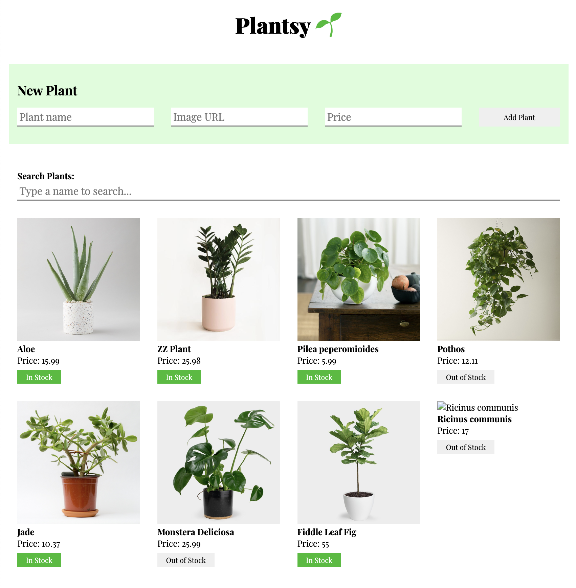

# Plantsy

## Description

This is Plantsy, a simple React app I built for managing a plant store admin panel. It hooks up to a fake JSON backend so you can:

- **Fetch** and display all available plants when the page loads 
- **Add** new plants via using a form (they'll get saved in the backend)
- **Toggle** plant stock status locally ("In Stock" / "Out of Stock")  
- **Search** and filter plants by name in real time  

## Table of contents

- [Demo](#demo)  
- [Prerequisites](#prerequisites)  
- [Setup](#setup)  
- [Testing](#testing)  

## Demo

## Prerequisites

- Node.js v14 or later  
- npm (bundled with Node.js)  

## Setup

1. After cloning the repo, run `npm install`
2. Start the backend server: `npm run server`  
3. Start the React app: `npm run dev`  
4. Follow the link on your browser.

## Testing

- Run `npm run test`